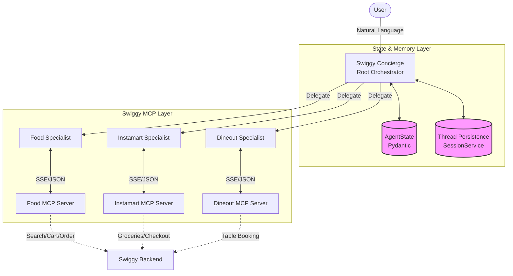

# Swiggy Concierge: Built on Swiggy MCP

A hierarchical multi-agent system built on the **Google Agent Development Kit (ADK)** that orchestrates food delivery, grocery shopping, and restaurant reservations through Swiggy's MCP (Model Context Protocol) platform — all from a single conversational interface.

> **Mock data notice:** All restaurant names, product listings, prices, ratings, and order history returned by the local mock servers are **AI-generated** for development and demo purposes only. They do not reflect real Swiggy listings or market prices.

---

## Table of Contents

1. [What It Does](#what-it-does)
2. [Architecture](#architecture)
3. [Project Structure](#project-structure)
4. [Getting Started](#getting-started)
5. [How to Use the Agent](#how-to-use-the-agent)
6. [Agentic Flows](#agentic-flows)
7. [Guardrails](#guardrails)
8. [Swiggy MCP Onboarding](#swiggy-mcp-onboarding)

---

## What It Does

### 🥗 Use Case 1 — Macro-Sync Nutritional Agent
> *"I want a high-protein vegetarian dinner."*

The agent doesn't just search for food — it thinks nutritionally. If the best local restaurant provides only 15g of protein but the user needs 35g, the orchestrator **autonomously calls the Instamart agent** to find a supplement (Greek yogurt, paneer, whey protein) and stages it in the grocery cart — while placing the food order at the same time.

**Result:** One conversation. Two commerce verticals. Nutritional goal met.

---

### 🔄 Use Case 2 — Predictive Auto-Restock
> *No prompt needed.*

The Instamart Agent analyses order history to spot reorder patterns — milk every 3 days, protein powder every 2 weeks. Before you run out, it proactively stages a cart and asks:

> *"I've staged your usual Tuesday restock: 2× Amul Milk 1L, 1× Tata Tea 250g — ₹136 total. Confirm to place?"*

The order is never placed without explicit user confirmation.

---

### 🍽️ Dineout — Table Booking Agent
> *"Book a table for 2 at a good Italian place tonight."*

A dedicated Dineout Agent handles restaurant discovery, real-time slot availability, and free table booking. It always confirms with the user before calling `book_table`. Only free reservations (`bookingPrice=0`) are supported in the current beta.

---

## Architecture

```
┌──────────────────────────────────────────────┐
│            ADK Web  (adk web)                │
│         http://localhost:8000                │
└───────────────────┬──────────────────────────┘
                    │
        ┌───────────▼────────────┐
        │    SwiggyOrchestrator  │  agent.py → root_agent
        │    (Root Agent)        │  instructions.py
        └──────┬────────┬────────┘
               │        │        │
    ┌──────────▼──┐ ┌────▼──────┐ ┌▼───────────┐
    │  FoodAgent  │ │Instamart  │ │DineoutAgent│
    │  14 tools   │ │Agent      │ │ 8 tools    │
    └──────┬──────┘ │13 tools   │ └─────┬──────┘
           │        └────┬──────┘       │
           │             │              │
    ┌──────▼──────┐ ┌────▼──────┐ ┌────▼───────┐
    │ Food MCP    │ │Instamart  │ │Dineout MCP │
    │ :8001/sse   │ │MCP :8002  │ │:8003/sse   │
    │ (mock/prod) │ │/sse       │ │(mock/prod) │
    └─────────────┘ └───────────┘ └────────────┘
```

## 🧠 Agentic Architecture

The Swiggy Concierge uses a hierarchical orchestration pattern where a central "Brain" (Root Agent) manages specialized "Limbs" (Sub-Agents).



### 🔐 State & Session Management
1.  **AgentState**: Built on Pydantic models. Every tool call and agent transition is validated against a central schema to prevent "hallucinated" carts.
2.  **Thread Persistence**: Uses the ADK's `InMemorySessionService` (swappable for Redis/SQL). Conversations are serialized by `threadId`, ensuring the Concierge remembers your nutritional deficit across multi-turn chats.
3.  **Source of Truth**: The agent is instructed to call `get_food_cart` or `get_booking_status` before making new suggestions, ensuring the internal AI state stays in sync with the actual Swiggy server state.

### Component Responsibilities

| Layer | File | Purpose |
|-------|------|---------|
| Root Orchestrator | `agent.py` | ADK entry point — defines `root_agent`, wires sub-agents |
| Instructions | `instructions.py` | All agent personas, use-case logic, and guardrails |
| Sub-Agents | `agents/` | One file per domain (Food, Instamart, Dineout) |
| MCP Factory | `tools/mcp.py` | Builds toolset connections — local stubs or production URLs |
| Guardrail Plugin | `tools/plugins.py` | Hard validations before results reach the LLM |
| Mock Servers | `mock_servers/` | Local FastMCP stubs for all 3 MCP endpoints |

---

## 🏗️ Project Structure
```text
swiggy/
├── swiggy_concierge/     # Core Agent Package (Rebranded)
│   ├── subagents/        # Food, IM, Dineout Specialists
│   ├── tools/            # MCP Connectors & Guardrail Plugins
│   ├── agent.py          # Entry Point (Root Orchestrator)
│   └── instructions.py   # Strict System Instructions
├── mock_servers/         # Local MCP Stubs (Food, IM, Dineout)
└── tests/                # Production Test Suite (Multi-Turn)
├── pyproject.toml        # Dependency config
└── README.md

---

## Getting Started

### Prerequisites

- Python 3.11+
- [`uv`](https://docs.astral.sh/uv/) package manager
- A Gemini API key (set as `GOOGLE_API_KEY`)

### Step 1 — Clone and install

```bash
git clone <repo-url>
cd swiggy
uv sync
```

Or if installing fresh:

```bash
uv add google-adk mcp uvicorn
```

### Step 2 — Set your API key

```bash
# Windows PowerShell
$env:GOOGLE_API_KEY = "your_gemini_api_key_here"

# macOS / Linux
export GOOGLE_API_KEY="your_gemini_api_key_here"
```

### Step 3 — Start the mock MCP servers

Open a terminal and run:

```bash
uv run python mock_servers/main.py
```

You should see:

```
Starting Swiggy Mock MCP Servers...
  Food      → http://localhost:8001/sse
  Instamart → http://localhost:8002/sse
  Dineout   → http://localhost:8003/sse
```

Keep this terminal open. The servers must stay running while you use the agent.

### Step 4 — Start the ADK web interface

Open a **second terminal** and run:

```bash
uv run adk web
```

Then open your browser at:

```
http://localhost:8000
```

Select **`root_agent`** from the agent dropdown, and start chatting.

---

## How to Use the Agent

### Example prompts to try

**Nutritional use case:**
```
I want a high-protein vegetarian meal. I need at least 30g of protein.
```
The agent will search restaurants, estimate protein, identify any gap, and suggest an Instamart supplement.

**Auto-restock:**
```
Check if I need to restock any groceries based on my order history.
```
The agent analyses past orders and proactively stages a cart if anything is running low.

**Dineout:**
```
Book a table for 2 at a good Italian restaurant in Koramangala tonight.
```
The agent searches, shows slots, and books a free table after you confirm.

**General food order:**
```
Order a Chicken Biryani from the best-rated place near me.
```

### Confirming orders

The agent **always asks for confirmation** before placing any order. Just reply `yes` or `confirm` when prompted. You can say `no` or `cancel` at any point.

### Switching to production

When you have real Swiggy MCP credentials:

```bash
# Windows PowerShell
$env:SWIGGY_ENV = "production"
$env:SWIGGY_TOKEN = "your_bearer_token"

# macOS / Linux
export SWIGGY_ENV=production
export SWIGGY_TOKEN=your_bearer_token
```

Then restart `adk web`. No code changes needed — `tools/mcp.py` handles the URL switch automatically.

---

## Agentic Flows

### Macro-Sync Flow
```
User: "I want a high-protein veg dinner"
  → Orchestrator delegates to Food Agent
  → Food Agent: get_addresses → search_restaurants → get_restaurant_menu → search_menu
  → Estimates protein: Paneer Tikka = ~18g
  → Orchestrator: gap identified (35g needed − 18g = 17g short)
  → Delegates to Instamart Agent
  → Instamart Agent: search_products("greek yogurt") → returns variants
  → Shows user: "Amul Greek Yogurt 400g — 10g protein, ₹85. Add this?"
  → User: "Yes"
  → Instamart Agent: update_cart
  → Orchestrator: "Ready to place: Paneer Tikka + Greek Yogurt. Total protein ~28g. Confirm?"
  → User: "Yes"
  → Food Agent: place_food_order
  → Instamart Agent: checkout
```

### Auto-Restock Flow
```
Triggered by orchestrator or user prompt
  → Instamart Agent: get_orders → scans last 10 orders
  → Detects: Amul Milk ordered 3× in 9 days → avg interval: 3 days
  → Predicts: next run-out tomorrow
  → search_products("amul milk") → update_cart (staged only, not placed)
  → Orchestrator: "Staged Tuesday restock: 2× Amul Milk 1L (₹108). Confirm?"
  → User: "Yes"
  → Instamart Agent: checkout
```

### Dineout Booking Flow
```
User: "Book a table for 2 at an Italian place tonight"
  → Dineout Agent: search_restaurants_dineout
  → Returns: Trattoria Italia (4.6★, 1.8 km), Barbeque Nation (4.4★, 4.2 km)
  → User picks Trattoria Italia
  → Dineout Agent: get_restaurant_details → get_available_slots
  → Shows: "7 PM (8 seats free), 8 PM (4 seats), 9 PM (2 seats)"
  → User picks 7 PM
  → Dineout Agent: create_cart
  → Orchestrator: "Confirm: 2 guests at Trattoria Italia, 7 PM — free booking?"
  → User: "Yes"
  → Dineout Agent: book_table
  → "Booked! Confirmation: SW493021. Check your Swiggy app."
```

---

## Guardrails

All guardrails are enforced at the **plugin layer** (before the LLM reasons about them) or within tool responses — not just in instructions. This prevents instruction drift and saves tokens.

| Rule | Where Enforced |
|------|----------------|
| No order placed without user confirmation | All agent instructions |
| Food cart capped at ₹1000 (beta limit) | `place_food_order` + `SwiggyGuardrailPlugin` |
| Restaurants > 5 km filtered from Food results | `SwiggyGuardrailPlugin.after_tool_callback` |
| Restaurants > 10 km flagged in Dineout results | Dineout agent instructions |
| Raw IDs never shown to users | All agent instructions |
| Non-idempotent tools use check-then-retry pattern | Instructions + ADK retry plugin |
| Only free Dineout reservations accepted | `book_table` + Dineout instructions |

---

## Swiggy MCP Onboarding

See [`swiggy_onboarding.md`](./swiggy_onboarding.md) for the full application guide — what to register, redirect URIs, and how to switch to production credentials once approved.
# swiggy-MCP
